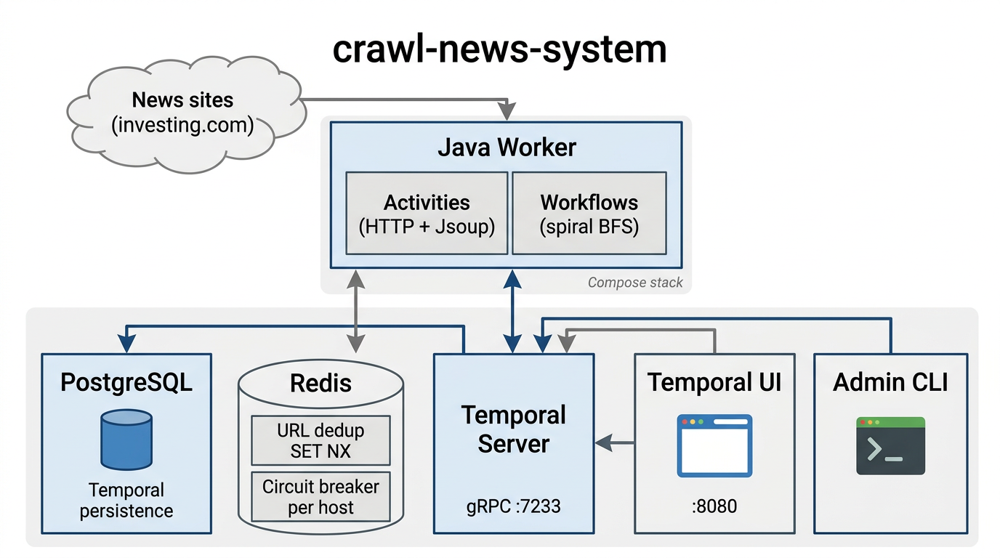
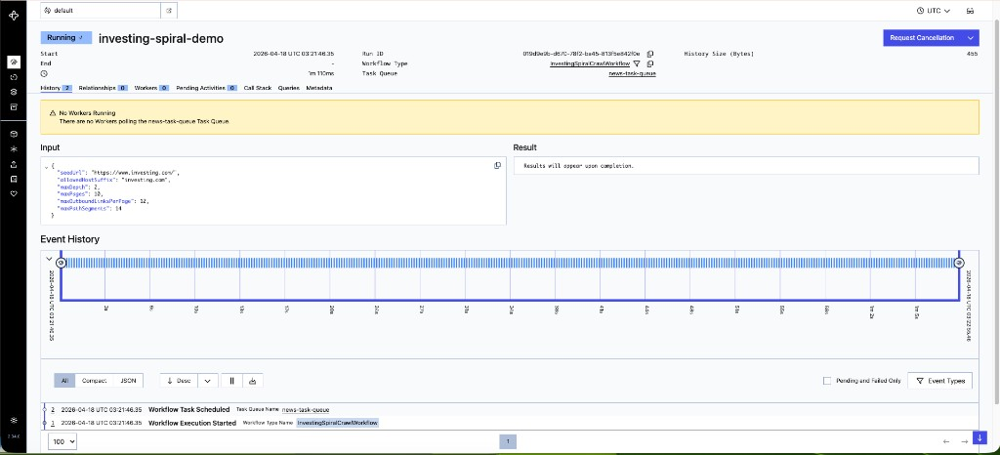

# crawl-news-system

> Temporal-orchestrated news crawling in **Java 21**: spiral BFS from a seed URL, **three-layer dedup** (workflow + Redis `SET NX` + Postgres `url_sha256`), **Redis per-domain circuit breaker**, and **Docker Compose** for one-shot local / single-host deploys.

> Built with help from **Claude Agent** (Anthropic) — pair-coding through design, refactors, bug hunts, and CI setup.

---

## Architecture



<details>
<summary>Text diagram (for terminals)</summary>

```
┌─────────────────────────────────────────────────────────────────────────────┐
│                           Docker Compose                                     │
│                                                                              │
│   ┌─────────────┐     ┌─────────────┐     ┌──────────────────────────────┐  │
│   │ Temporal UI │     │  Temporal   │     │   temporal-postgresql :5432   │  │
│   │   :8080     │     │   :7233     │────▶│   (Temporal persistence)      │  │
│   └──────┬──────┘     └──────┬──────┘     └──────────────────────────────┘  │
│          │                   │                                              │
│          │            ┌───────▼───────┐     ┌──────────────────────────────┐  │
│          │            │ crawl-worker │────▶│ crawl-postgres :5433         │  │
│          │            │  (Java 21)   │     │ crawl_url_seen (SHA-256 PK)  │  │
│          │            └───────┬──────┘     └──────────────────────────────┘  │
│          │                    │                                              │
│   ┌──────▼──────┐      ┌──────▼──────┐     ┌──────────────────────────────┐  │
│   │ admin-tools │      │    Redis    │     │  News origins (e.g. seed)    │  │
│   │  (CLI)      │      │   :6379     │     │  HTTPS fetch in activities   │  │
│   └─────────────┘      └─────────────┘     └──────────────────────────────┘  │
│                                                                              │
└─────────────────────────────────────────────────────────────────────────────┘
```

</details>

---

## Key capabilities

| Area | What it does |
|------|----------------|
| **Orchestration** | Temporal **Workflows** (deterministic spiral crawl) + **Activities** (HTTP, Jsoup, Redis, JDBC). |
| **Dedup (3 layers)** | In-run `HashSet` → Redis **`SET NX`** (TTL) → Postgres **`url_sha256`** (durable). |
| **Anti-trap** | Max depth / pages / outbound links, path-segment cap, same-host filter. |
| **Circuit breaker** | Redis-backed per host; workflow **`Workflow.sleep`** when circuit is open. |
| **Deploy** | `docker compose` — Temporal stack + crawl DB + Redis + worker + UI. |

---

## Tech stack

| Layer | Choice |
|-------|--------|
| Runtime | **Java 21**, Maven, shaded worker JAR |
| Orchestration | **Temporal** Java SDK (`temporal-sdk`) |
| Hot cache / CB | **Redis 7** (Jedis), AOF volume |
| Durable dedup | **PostgreSQL 16** (`crawl` DB, `crawl_url_seen`) |
| Temporal persistence | **PostgreSQL** (separate instance in Compose) |
| HTML | **Jsoup** + `java.net.http.HttpClient` |
| Pooling | **HikariCP** for crawl JDBC |

---

## Prerequisites

- **Docker** + **Docker Compose** v2 (required to run the full stack)
- **Java 21** + **Maven 3.9+** (only if you build/run the worker **outside** Docker)

---

## Quick start

### One command to rule them all

```bash
./run-all.sh
```

This script: brings the stack **up in detached mode** with a fresh **build**, prints service URLs, and prints a ready-to-paste **`temporal workflow start`** example for the investing crawl.

### Full stop + restart (fast reset)

```bash
./restart-all.sh
```

Runs **`docker compose down`** then **`docker compose up --build -d`** (containers + networks; **volumes are kept** so Temporal / crawl DB / Redis data survive). To also wipe volumes: `docker compose down -v` then `./restart-all.sh` or edit the script.

### Or manually

```bash
# Build and run (foreground logs)
docker compose up --build

# Or detached
docker compose up --build -d
```

### Services

| Service | URL / endpoint |
|---------|----------------|
| **Temporal UI** | [http://localhost:8080](http://localhost:8080) |
| **Temporal gRPC** | `localhost:7233` (workers use `temporal:7233` inside Compose) |
| **PostgreSQL (Temporal)** | `localhost:5432` — credentials in [`.env`](.env) |
| **crawl-postgres** | `localhost:5433` — DB `crawl`, user `crawl` / pass `crawl` |
| **Redis** | `localhost:6379` |

### Stop everything

```bash
docker compose down
```

Remove volumes as well (wipes Temporal + crawl DB + Redis data):

```bash
docker compose down -v
```

---

## Running locally (worker only, without Docker for the app)

The worker reads **environment variables** (see [docs/java-temporal-news-crawl.md](docs/java-temporal-news-crawl.md)). After Temporal, Redis, and crawl-postgres are reachable on localhost:

```bash
cd worker
export TEMPORAL_TARGET=127.0.0.1:7233
export REDIS_URL=redis://127.0.0.1:6379/0
export CRAWL_JDBC_URL=jdbc:postgresql://127.0.0.1:5433/crawl
export CRAWL_JDBC_USER=crawl
export CRAWL_JDBC_PASSWORD=crawl
mvn -q -DskipTests package && java -jar target/crawl-news-worker-1.0.0-SNAPSHOT.jar
```

---

## Demo (Temporal UI)



Example run: workflow ID **`investing-spiral-demo`**, type **`InvestingSpiralCrawlWorkflow`**, task queue **`news-task-queue`**, with the JSON input shown in the UI.

### If you see “No Workers Running”

Temporal **accepted** the workflow, but **no process is polling** `news-task-queue`, so workflow tasks never leave the queue. The UI may show **one pending Workflow Task** forever in that state — that task is the first “tick” of your workflow waiting for a worker.

That is almost always the **`crawl-worker`** container (not running, still connecting to Temporal, or gRPC failing on Docker Desktop). Check:

```bash
docker compose ps
docker compose logs crawl-worker --tail 80
docker compose up -d --build crawl-worker
```

You should see a log line like **`[crawl-worker] Polling Temporal target=... taskQueue=news-task-queue`**. If you never see it, the JVM is still failing to open a gRPC channel to Temporal (Compose sets `JAVA_TOOL_OPTIONS` to reduce common Docker / Netty issues).

When the worker is healthy, the banner disappears and **Event history** shows activities running.

### Start this workflow (recommended)

```bash
docker compose exec temporal-admin-tools temporal workflow start \
  --task-queue news-task-queue \
  --type InvestingSpiralCrawlWorkflow \
  --workflow-id investing-spiral-demo \
  --input '{"seedUrl":"https://www.investing.com/","allowedHostSuffix":"investing.com","maxDepth":2,"maxPages":10,"maxOutboundLinksPerPage":12,"maxPathSegments":14}'
```

Use a **new** `--workflow-id` for each run if a previous execution still exists.

### curl (HTTP checks only)

Workflow **start** is **gRPC** on `localhost:7233`, not a one-line REST `curl`. Use the **`temporal` CLI** (inside `temporal-admin-tools` as above, or [Temporal CLI](https://docs.temporal.io/cli) on your machine with `--address localhost:7233`). You can still use **curl** to confirm the UI is up:

```bash
curl -sS -o /dev/null -w "Temporal UI HTTP %{http_code}\n" http://localhost:8080/
```

---

## Workflows & CLI (Temporal)

All examples use task queue **`news-task-queue`** (see `TEMPORAL_TASK_QUEUE` in Compose).

### Demo workflow

```bash
docker compose exec temporal-admin-tools temporal workflow start \
  --task-queue news-task-queue \
  --type NewsDemoWorkflow \
  --workflow-id demo-manual-1 \
  --input '"local"'
```

### Investing spiral crawl (larger run)

Same pattern as the [demo](#demo-temporal-ui) above; example with more pages:

```bash
docker compose exec temporal-admin-tools temporal workflow start \
  --task-queue news-task-queue \
  --type InvestingSpiralCrawlWorkflow \
  --workflow-id investing-spiral-1 \
  --input '{"seedUrl":"https://www.investing.com/","allowedHostSuffix":"investing.com","maxDepth":2,"maxPages":25,"maxOutboundLinksPerPage":18,"maxPathSegments":14,"circuitSleepSeconds":45,"circuitMaxWaitsPerUrl":24}'
```

### Crawl an arbitrary site (example: kenh14.vn)

The same workflow type works for any site — only `seedUrl` and `allowedHostSuffix` differ. **Important:** suffix must match the seed host (e.g. `kenh14.vn`), otherwise the run ends immediately with `idleReason=seed_host_not_allowed_for_suffix=...`.

```bash
docker compose exec temporal-admin-tools temporal workflow start \
  --task-queue news-task-queue \
  --type InvestingSpiralCrawlWorkflow \
  --workflow-id kenh14-spiral-$(date +%s) \
  --input '{"seedUrl":"https://kenh14.vn/","allowedHostSuffix":"kenh14.vn","maxDepth":2,"maxPages":25,"maxOutboundLinksPerPage":18,"maxPathSegments":14,"circuitSleepSeconds":45,"circuitMaxWaitsPerUrl":24}'
```

> Workflow start is **gRPC** on `localhost:7233`, not REST — so there is no plain `curl` form. Use the CLI inside `temporal-admin-tools` as above (or install the [Temporal CLI](https://docs.temporal.io/cli) locally and pass `--address localhost:7233`).

Open **Temporal UI** → namespace **default** → workflow → history / result (`CrawlSummary`).

---

## Configuration (worker)

| Variable | Typical value | Purpose |
|----------|----------------|---------|
| `TEMPORAL_PEER_HOST` / `TEMPORAL_PEER_PORT` | `temporal` / `7233` | Entrypoint resolves to **IPv4** and sets `TEMPORAL_TARGET` (avoids gRPC address-type errors) |
| `TEMPORAL_NAMESPACE` | `default` | Namespace |
| `TEMPORAL_TASK_QUEUE` | `news-task-queue` | Worker poll queue |
| `REDIS_URL` | `redis://redis:6379/0` | Dedup `SET NX` + circuit breaker hashes |
| `CRAWL_JDBC_URL` | `jdbc:postgresql://crawl-postgres:5432/crawl` | Durable dedup (omit to disable) |
| `CRAWL_JDBC_USER` / `CRAWL_JDBC_PASSWORD` | `crawl` / `crawl` | Crawl DB credentials |
| `CRAWL_CB_FAILURE_THRESHOLD` | `5` | Failures before opening circuit |
| `CRAWL_CB_OPEN_SECONDS` | `90` | Circuit open duration |
| `WORKER_MAX_ACTIVITIES` | `16` | Max concurrent activity executions per worker |
| `WORKER_MAX_WORKFLOW_TASKS` | `8` | Max concurrent workflow task executions per worker |
| `WORKER_MAX_LOCAL_ACTIVITIES` | `16` | Max concurrent local-activity executions per worker |
| `CRAWL_PER_URL_SLEEP_MS` | `350` | Gentle per-URL spacing before HTTP fetch (set `0` to disable) |

### Scaling

- **Default replicas** — `crawl-worker` has `deploy.replicas: 3` in `docker-compose.yml`, so `docker compose up -d` starts **3 worker containers** sharing `news-task-queue`. Temporal load-balances tasks across all polling workers automatically.
- **Change replica count** — edit `deploy.replicas` in `docker-compose.yml`, or override on the CLI without editing:

  ```bash
  docker compose up -d --scale crawl-worker=5
  ```

- **Inside one worker** — bump `WORKER_MAX_ACTIVITIES` / `WORKER_MAX_WORKFLOW_TASKS` (used when several workflow executions share the worker). The current spiral workflow calls activities sequentially, so these only help when multiple executions run in parallel.

Fuller narrative: [docs/java-temporal-news-crawl.md](docs/java-temporal-news-crawl.md).

---

## Operations

### Clear Redis URL claims (dev only)

```bash
docker compose exec redis redis-cli KEYS 'crawl:v1:url:*'
# then DEL specific keys, or FLUSHDB on a throwaway instance
```

### Inspect crawl dedup rows

```bash
docker compose exec crawl-postgres psql -U crawl -d crawl -c "SELECT url_sha256, left(canonical_url,80), first_seen_at FROM crawl_url_seen ORDER BY first_seen_at DESC LIMIT 20;"
```

---

## Project structure

```
crawl-news-system/
├── run-all.sh                      # compose up -d --build + hints
├── restart-all.sh                  # compose down then up --build -d (keeps volumes)
├── docker-compose.yml              # Full stack
├── .env                            # Image pins + Temporal Postgres password
├── dynamicconfig/                  # Temporal dynamic config (dev)
├── crawl-db/init/                  # crawl-postgres schema (001_schema.sql)
├── docs/
│   ├── architecture-diagram.png
│   └── java-temporal-news-crawl.md # Deep-dive (English)
└── worker/
    ├── Dockerfile
    ├── pom.xml
    └── src/main/java/com/crawlnews/
        ├── crawl/                  # URL normalize, hashing, Redis CB, Postgres dedup
        ├── crawl/dto/              # Workflow / activity DTOs
        └── worker/                 # WorkerMain, workflows, activities
```

---

## Continuous Integration

GitHub Actions pipeline in [`.github/workflows/ci.yml`](.github/workflows/ci.yml) runs on every push to `main` and on every pull request:

- **`build-test`** — JDK 21 + Maven cache, `mvn -B verify` (compile + **JUnit 5 tests** + **JaCoCo** coverage + shaded jar). Fails if the shaded JAR is missing merged gRPC `META-INF/services/io.grpc.LoadBalancerProvider` entries (including `RoundRobinLoadBalancerProvider`). Uploads the fat JAR, Surefire reports, and the JaCoCo HTML report as artifacts.
- **`compose-validate`** — `docker compose config -q` catches syntax / interpolation errors.
- **`smoke`** — builds and boots the real stack, waits for Temporal + a polling `crawl-worker`, runs `NewsDemoWorkflow` end-to-end and asserts the result (`"ok:ci"`). On failure, dumps container logs and tears the stack down.

Run the same checks locally:

```bash
cd worker && mvn -B verify     # build + tests + shaded jar
docker compose config -q       # compose syntax
./run-all.sh                   # full smoke (manual)
```

---

## Acknowledgements

Codebase pair-coded with **Claude Agent** (Anthropic) for design, refactors, bug hunts, and CI setup.

---

## License

[ISC](LICENSE) © 2026 Pham Ngoc Lam.
