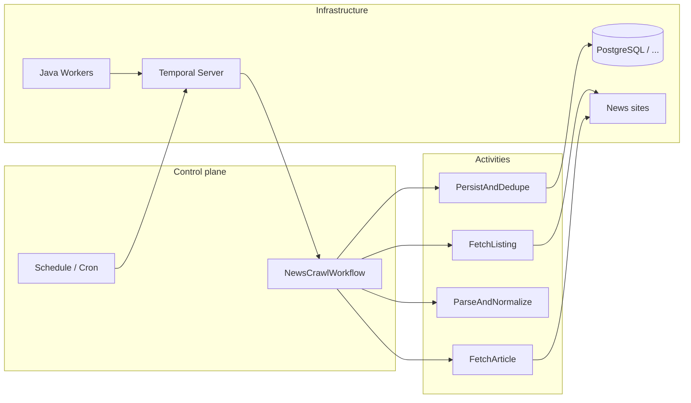

# News crawling with Java and Temporal

## Short answer

**Yes — this is a solid approach.** Temporal ships an official Java SDK. Model the crawl pipeline (discover URLs, fetch HTML, parse, persist, dedupe) with **Workflows** (durable orchestration) and **Activities** (I/O: HTTP, databases, files). Java **Workers** connect to **Temporal Server** (self-hosted or Temporal Cloud).

---

## Why Temporal fits news crawling

| Need | What Temporal gives you |
|------|-------------------------|
| Retries on slow sites / 5xx | Per-activity retry policies and backoff |
| Long-running jobs (many sources/pages) | `Workflow.sleep` without holding threads |
| Periodic runs | Schedules (cron) to start crawl workflows |
| Idempotency / avoid duplicate runs | Workflow IDs (e.g. `source + day`); signals/queries |
| Horizontal scale | Multiple workers on the same task queue |

**Note:** Crawling must respect **robots.txt**, site terms, and **rate limits**. Temporal does not replace legal or ethical constraints; enforce politeness inside **Activities** (delays, per-domain concurrency caps).

---

## High-level architecture



- **Workflow**: deterministic orchestration only — loops per source, controlled fan-out, `ActivityOptions` (timeouts, retries).
- **Activity**: HTTP (`HttpClient`, OkHttp), parsing (Jsoup, RSS/XML), DB writes, optional messaging.

---

## Example business flow

1. **Listing ingest**: Activity loads index/RSS/sitemap → returns URLs + metadata.
2. **Article fetch**: Per URL (or batch) — Activity downloads content; retries on transient failures.
3. **Normalize**: Extract title, body, published time, author; normalize encoding/time zones.
4. **Dedupe + store**: Canonical URL and/or content hash; DB upsert; optional embeddings later.

Optional **child workflow per source** limits blast radius and scales independently.

---

## Suggested Java module layout

```
crawl-news-system/
├── worker/                 # Worker main, registers workflows + activities
├── workflows/              # Deterministic orchestration only
├── activities/             # HTTP, DB, I/O
├── domain/                 # DTOs: Article, Source, CrawlResult
└── shared/                 # Constants, task queue names
```

Typical dependencies (pin versions in your build):

- `io.temporal:temporal-sdk`
- HTTP: OkHttp or `java.net.http`
- HTML/RSS: Jsoup and/or an XML/RSS parser

---

## Temporal building blocks you will use often

- **Workflow**: e.g. `NewsCrawlWorkflow` — coordination; `Workflow.sleep(Duration)` between requests to the same host.
- **Activity**: `fetchListing`, `fetchArticle`, `saveArticles` — separate timeouts/retries (fetch usually more aggressive than persist).
- **Schedule**: e.g. daily crawl at 06:00 in a chosen time zone.
- **Child workflows** (optional): one child per source for parallelism with bounded concurrency.

---

## Idempotency and safety

- Stable **workflow IDs** per source + day (e.g. `crawl-vnexpress-2026-04-18`) with an appropriate **workflow id reuse policy** to avoid duplicate daily runs.
- Make **persist** activities **idempotent** (upsert on `canonical_url` or `content_hash`).
- **Secrets**: never embed in workflow code; inject via worker environment or encrypted payload converters.

---

## Limits and best practices

- **Workflow code must be deterministic** — avoid raw `Instant.now()` / `Random` in workflow code; use `Workflow.currentTimeMillis()` / `Workflow.getRandom()`.
- **Large payloads**: avoid multi-megabyte activity results in history; store blobs in object storage and pass references.
- **Rate limits**: workflow semaphores, per-queue worker concurrency, jittered sleeps.
- **Legal / ethical**: crawl only what you are allowed to; prefer **RSS or official APIs** when available.

---

## Official references

- [Temporal Java SDK](https://docs.temporal.io/dev-guide/java)
- Concepts: **Workflows**, **Activities**, **Schedules**, **Workers**

---

## Deployment (Docker Compose)

The repository ships a **single Compose file** that runs:

- **PostgreSQL** — Temporal persistence (port **5432**)
- **crawl-postgres** — Application crawl DB for durable URL / content hashes (port **5433**)
- **Temporal** (`temporalio/auto-setup`) — server with schema bootstrap
- **Temporal UI** — Web UI on port **8080**
- **Admin tools** — optional CLI container (`temporal` / `tctl`) for ops
- **crawl-worker** — minimal Java worker (demo workflow) you can extend into real crawl logic

From the repository root:

```bash
docker compose up --build
```

After services are healthy:

- **Temporal UI**: [http://localhost:8080](http://localhost:8080)
- **gRPC frontend**: `localhost:7233` (workers use `temporal:7233` inside the Compose network)

Image versions are pinned in `.env` at the repo root so upgrades are explicit.

### Try a demo workflow from the admin-tools container

```bash
docker compose exec temporal-admin-tools temporal workflow start \
  --task-queue news-task-queue \
  --type NewsDemoWorkflow \
  --workflow-id demo-manual-1 \
  --input '"local"'
```

Then open the run in **Temporal UI** and inspect history.

### Configuration via environment (worker service)

| Variable | Default | Purpose |
|----------|---------|---------|
| `TEMPORAL_TARGET` | `temporal:7233` | gRPC target for the worker |
| `TEMPORAL_NAMESPACE` | `default` | Temporal namespace |
| `TEMPORAL_TASK_QUEUE` | `news-task-queue` | Task queue name |
| `REDIS_URL` | `redis://redis:6379/0` in Compose | Redis for crawl URL dedup (`SET NX` + TTL) |
| `CRAWL_JDBC_URL` | `jdbc:postgresql://crawl-postgres:5432/crawl` in Compose | Optional; unset = skip Postgres dedup |
| `CRAWL_JDBC_USER` / `CRAWL_JDBC_PASSWORD` | `crawl` / `crawl` | Crawl database credentials |
| `CRAWL_SEED_URL` | `https://www.investing.com/` | Documented default seed (workflow input carries the real seed) |
| `CRAWL_ALLOWED_HOST_SUFFIX` | `investing.com` | Same-host filter for outbound links |
| `CRAWL_CB_FAILURE_THRESHOLD` | `5` | Consecutive “hard” failures before opening the circuit |
| `CRAWL_CB_OPEN_SECONDS` | `90` | How long the circuit stays open (no HTTP attempts) |

### Implemented crawl: Investing “spiral” + Redis + Postgres

The worker registers **`InvestingSpiralCrawlWorkflow`**: bounded BFS from a seed (default **investing.com**), **spiral-style** expansion by depth ring, traps mitigated via **max depth**, **max pages per run**, **max outbound links per page**, **max path segments**, **in-run queued-URL set**, **Redis** keys `crawl:v1:url:{sha256(canonical)}` with **`SET NX`** and a TTL, and **Postgres** table `crawl_url_seen` keyed by the same **`url_sha256` CHAR(64)** for durable dedup. A failed HTTP fetch **removes** the Redis claim key so activity retries can try again.

#### Dedup layers (why both Redis and Postgres?)

| Layer | Where | Role |
|-------|--------|------|
| **1 — Workflow frontier** | Temporal workflow memory (`HashSet` of queued URLs) | Stops enqueueing the same canonical URL many times in **one** run (deterministic, no I/O). |
| **2 — Redis `SET NX`** | Hot cache / coordination | Fast cross-worker “claim this URL for fetch” with **TTL (7 days)**; after TTL the key disappears, so another run *could* refetch unless layer 3 says otherwise. |
| **3 — Postgres `url_sha256` PK** | `crawl-postgres` / `crawl_url_seen` | **No TTL**: long-lived record that this canonical URL was already fetched. Checked **before** Redis; on success we `INSERT … ON CONFLICT DO NOTHING` and store optional **`content_sha256`** (normalized body text) for future near-duplicate logic. |

Redis TTL is **finite by design** (memory, stale coordination). Postgres is the **source of truth** for “have we already stored this URL?” across weeks and restarts. If `CRAWL_JDBC_URL` is empty, only layers 1–2 apply.

**Per-domain circuit breaker (Redis):** consecutive failures (default **5**) for responses **≥ 500** or **429**, or transport errors, increment a Redis hash per host. When the threshold is hit, the circuit **opens** for `CRAWL_CB_OPEN_SECONDS` (default **90**). While open, the activity returns **`circuitOpen`** without claiming the URL; the workflow calls **`Workflow.sleep`** (`circuitSleepSeconds` on the input, default **45**) and retries the same frontier URL until the window passes or **`circuitMaxWaitsPerUrl`** is exceeded. **Temporal activity retries** alone would keep hitting a dead origin; this pattern backs off in workflow time instead. A successful fetch **clears** the breaker key for that host.

---

## Summary

Java + Temporal is a strong fit for **reliable news crawling**: durable orchestration, retries, schedules, and scalable workers. The actual crawl work lives in **Activities** and HTTP/HTML libraries; Temporal provides **operational reliability** for the full pipeline. Use **Docker Compose** in this repo for a one-command local or single-host deployment baseline.
